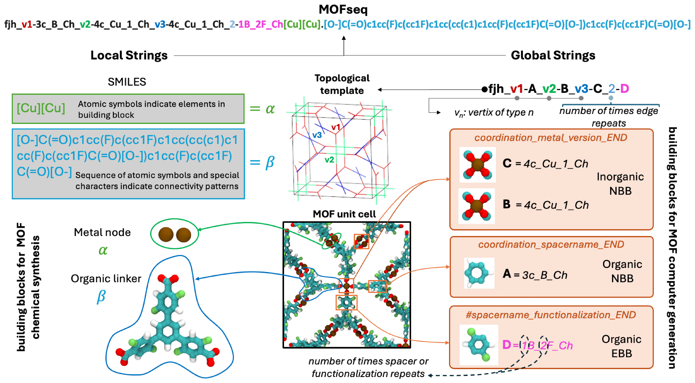

# [Highly Accurate and Fast Prediction of MOF Free Energy Via Machine Learning](https://chemrxiv.org/engage/chemrxiv/article-details/686fedbc43bc52e4ec4edfc6)
This repository contains the implementation of our proposed machine learning approach for MOF Free Energy Prediction.

<p align="center" width="100%">
    
    <!--  -->
    <br>
    <em> Schematic representation of MOFseq </em>
</p>

For more details check [our pre-print](https://chemrxiv.org/engage/chemrxiv/article-details/686fedbc43bc52e4ec4edfc6)

## Installation
You can install MOF-FreeEnergy by following these steps:
```
git clone https://github.com/vertaix/MOF-FreeEnergy.git
cd MOF-FreeEnergy
conda create -n <environment_name> requirement.txt
conda activate <environment_name>
```
## Usage
### Preparing the data
Refer to this [notebook](data_preparation.ipynb) and change the `paths` and the `max_len` value accordingly. The prepared data for 2000 max_len can also be directly downloaded from this [link](https://drive.google.com/drive/folders/18joRpZCNW8guhHTtjZJYA0IAsE3-Wm-7).

### Training
Run 
```python
python src/llmprop_train.py
```

### Evaluating
Run 
```python
python src/llmprop_evaluate.py
```

## Citation
```bibtex
@article{rubungo2025highly,
  title={Highly Accurate and Fast Prediction of MOF Free Energy Via Machine Learning},
  author={Rubungo, Andre Niyongabo and Fajardo-Rojas, Fernando and G{\'o}mez-Gualdr{\'o}n, Diego and Dieng, Adji Bousso},
  year={2025}
}
```